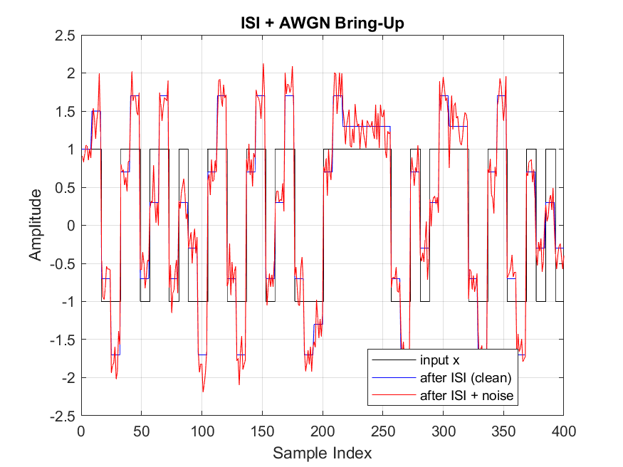
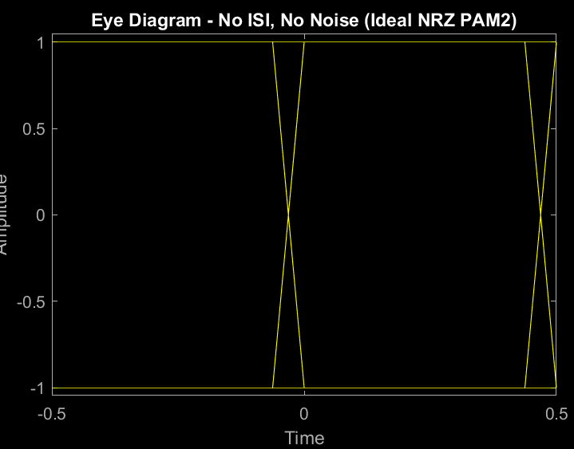
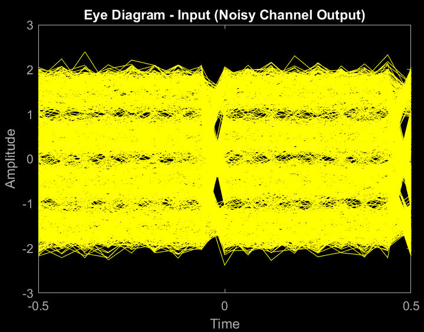
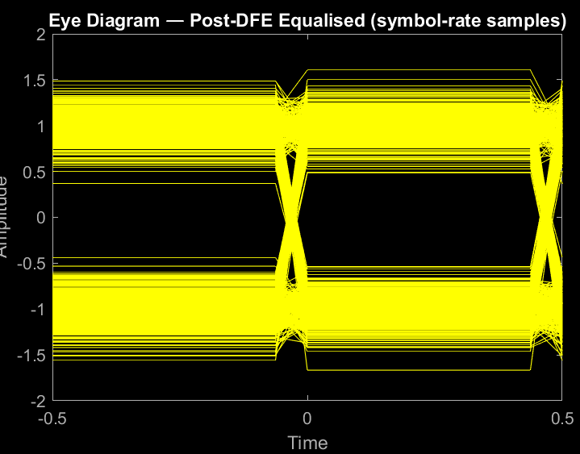
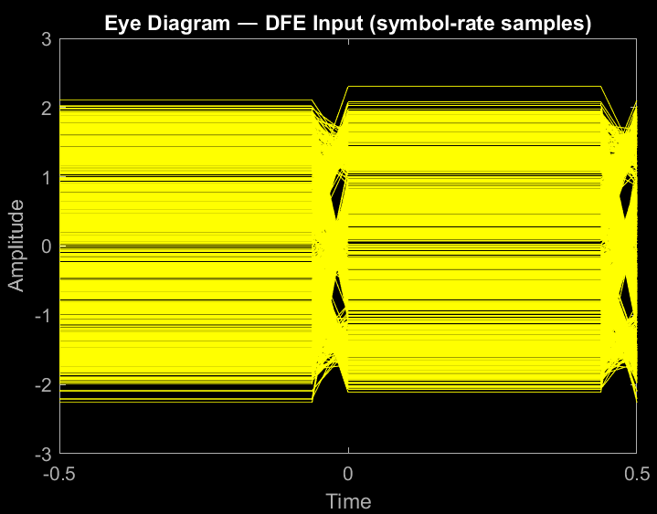
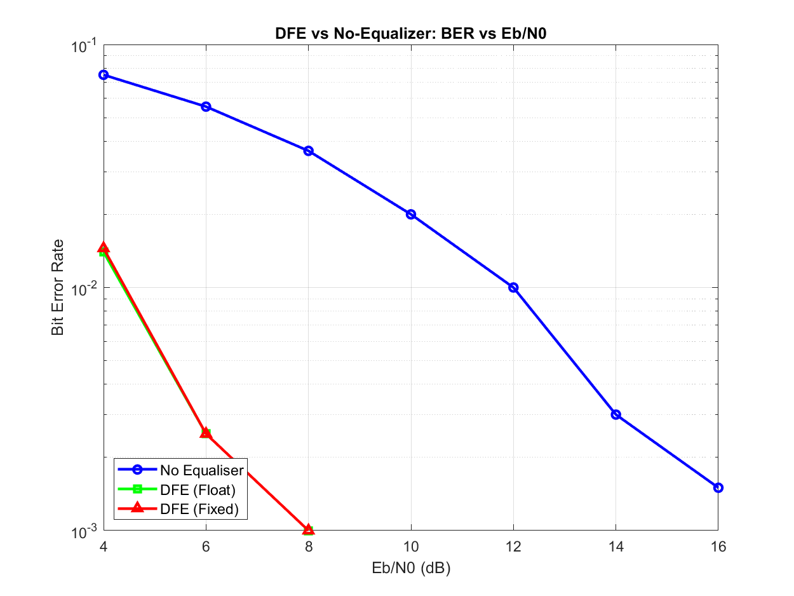

# Decision Feedback Equalizer (DFE) Co-Simulation Project Report

**Date:** May 2, 2026  

---

## Summary

The project combines MATLAB algorithmic modeling with SystemVerilog hardware implementation to verify bit-level equivalence between floating-point reference, fixed-point reference, and synthesizable RTL for a DFE that couldbe used in a SerDes enviroment

**Design Scope:**
- **Channel:** Fixed ISI with taps [1.0, 0.5, −0.2] at symbol boundaries on 8× oversampled NRZ PAM2
- **Equalizer:** 2-tap fixed-coefficient DFE, Q4.11 input/output, Q1.15 coefficients
- **Quantization:** 16-bit signed fixed-point throughout (matching typical DSP/FPGA bit widths)

---

## I. Technical Foundation

### A. ISI Channel Model

**Signal Model:**
- **Modulation:** NRZ PAM2 (binary {+1, −1})
- **Pulse shape:** Rectangular NRZ, 
- **Oversampling:** 8× samples per symbol (sps=8)
- **ISI Taps:** h = [1.0, 0.5, −0.2] placed at symbol-spaced intervals on oversampled grid



**AWGN Injection:**
- Input: Eb/N0 (dB) or direct σ
- Computation: σ = √(1/(2·EbN0_linear))
- Application: Additive white Gaussian noise

**Eye Diagram Characteristics:**
- **No ISI, no noise:** Two crisp dots (±1 at sampling instant)



- **ISI + noise:** Vertical eye opening limited by ISI; noise creates vertical scatter



- **Post-DFE:** Opening improves (ISI cancelled by feedback)





---

### B. DFE Architecture

**Topology:**
```
rx_sample → [subtract feedback] → Slicer (threshold @0) → Decision Register
                  ↑                                            ↓
                  └──────── Tap Bank (2-tap, fixed coeff) ←────┘
```

**Data Flow (per symbol clock):**
1. Combinational: equalized = rx_sample − feedback
2. Combinational: decision = sign(equalized)
3. At clock edge: decision registered; tap-bank shift register updated
4. Next cycle: new feedback available (1-cycle delay)

**Fixed-Tap Philosophy:**
- Coefficients pre-optimized offline (known channel)
- No adaptation; no convergence transient
- Minimal hardware; deterministic behavior
- Suitable for known/static channels; not for unknown/time-varying channels


---

### C. Fixed-Point Arithmetic

**Quantization Scheme:**
| Signal | Format | Range | Interpretation |
|--------|--------|-------|-----------------|
| rx_sample, equalized | Q4.11 | [−8, +8) | 11 fractional bits, 5 integer bits |
| coefficients | Q1.15 | [−2, +2) | 15 fractional bits, 1 sign bit |
| tap_sum (feedback) | Q4.11 | [−8, +8) | From MAC output after right-shift |
| MAC accumulator | Q2.30 | [−4, +4) intermediate | 32-bit signed; rescaled to output |

**Scaling Derivation:**
```
tap_sum = coeff₀ × dec_val₀ + coeff₁ × dec_val₁
        = Q1.15 × {+0x7FFF | −0x8000} + Q1.15 × {+0x7FFF | −0x8000}

Intermediate product:  Q1.15 × Q1.15 → Q2.30 (sign-extended 32-bit)
Accumulator:           Q2.30 (32-bit signed int64)
Output shift:          >> 19  ≡  >> (30 − 11)  ≡  Q2.30 → Q4.11
```

**Decision Encoding:**
- Bit value 1 → decision_val = +0x7FFF (≈ +1.0 in Q1.15)
- Bit value 0 → decision_val = −0x8000 (≈ −1.0 in Q1.15)

**Saturation:**
Subtractor output clamped to [−32768, +32767] to prevent overflow.

---

## II. Implementation Architecture

### A. MATLAB Reference Models

#### 1. `isi_channel_model.m`
**Purpose:** Generate oversampled ISI waveform from TX symbols.

**Inputs:**
- `tx_symbols`: Vector of ±1 (binary)
- `h`: ISI tap vector [h₀, h₁, h₂, ...]
- `sps`: Samples per symbol (default 8)

**Processing:**
1. Upsample tx_symbols by factor sps (insert zeros between symbols)
2. Apply rectangular NRZ pulse shape (convolve with ones(sps, 1))
3. Apply ISI channel (convolve with h, padded to symbol boundaries)
4. Downsample by factor sps at symbol clock (return symbol-rate output)

**Output:** rx_symbols (symbol-rate, scaled to ±1 plus ISI)

#### 2. `dfe_reference.m` (Floating-Point)
**Purpose:** Golden algorithmic reference (no quantization).

**Algorithm:**
```matlab
equalized = rx_sym - (coeffs * past_decisions.');
decision = sign(equalized);  % ±1
past_decisions = [decision, past_decisions(1:end-1)];  % Shift register
```

**Characteristics:**
- Full floating-point precision
- Validates algorithmic correctness
- Not bit-for-bit with RTL (due to rounding differences)

#### 3. `dfe_reference_fixed.m` (Fixed-Point, RTL-Equivalent)
**Purpose:** Quantized DFE that matches RTL behavior exactly.

**Algorithm:**
```matlab
% Convert decision to Q1.15 format
decision_bits = (equalized_int16 >= 0) ? 1 : 0;
dec_val = decision_bits ? int16(0x7FFF) : int16(-0x8000);

% MAC with Q1.15 × Q1.15 → Q2.30
acc = int64(0);
for i = 1:NUM_TAPS
    acc = acc + int64(coeffs_q15(i)) * int64(dec_val_history(i));
end

% Shift to Q4.11
tap_sum_int16 = int16(bitshift(acc, -(30-11)));

% Saturating subtractor
equalized_next = saturate(rx_int16 - tap_sum_int16, -32768, 32767);
```

**Fidelity:** Designed to produce **identical** decisions to RTL, including saturation and rounding artifacts.

#### 4. `export_vectors.m`
**Purpose:** Convert floating-point samples to Q4.11 hex for HDL simulation.

**Process:**
1. Quantize rx_symbols to Q4.11: int_val = round(rx_symbols × 2^11)
2. Typecast to uint16 (two's complement interpretation)
3. Convert to 4-digit uppercase hex (e.g., 086C, 0916)
4. Write one hex value per line to `channel_out.hex`

**Parallel Output:** TX symbols (±1) to `tx_bits.txt` for reference.

#### 5. `validate_hdl.m`
**Purpose:** Compare HDL decisions to MATLAB references (floating and fixed).

**Process:**
1. Load channel_out.hex and quantize to int16
2. Run floating-point DFE on same data
3. Run fixed-point DFE on same data
4. Load hdl_decisions.txt from simulation
5. Compute BER against fixed-point reference (authoritative)
6. Diagnose any mismatch: inverted bits, ±1 phase shift, other patterns

**Output:** Pass/Fail verdict; diagnostics for debugging.

#### 6. `sweep_ber.m`
**Purpose:** Multi-point Eb/N0 sweep to characterize DFE gain across SNR.

**Loop:**
```matlab
for ebn0_db = [4, 6, 8, 10, 12, 14, 16]
    sigma = sqrt(1 / (2 * 10^(ebn0_db/10)));
    
    for each trial:
        rx_sym = isi_channel_model(...) + sigma * randn(...)
        ber_no_eq = measure_ber(rx_sym, tx_bits)          % Threshold at 0
        ber_float = measure_ber(dfe_reference(...), tx_bits)
        ber_fixed = measure_ber(dfe_reference_fixed(...), tx_bits)
end

% Save: BER_SWEEP_DATA.mat, plot: ber_sweep.png (semilogy)
```

**Output:** Three curves (no-equalizer, float DFE, fixed DFE) vs Eb/N0; expected DFE gain ~0.5–1.5 dB.

---

### B. SystemVerilog Implementation

#### 1. `slicer.sv`
**Function:** Combinational hard-decision threshold.

**Logic:**
```verilog
assign decision = ~data_in[DATA_W-1];
```

**Interpretation:**
- data_in < 0 (sign bit = 1) → decision = 0 (represents −1)
- data_in ≥ 0 (sign bit = 0) → decision = 1 (represents +1)

**Tie-break:** data_in = 0 → sign bit = 0 → decision = 1 (matches MATLAB sign(0)=1).

#### 2. `dfe_tap_bank.sv`
**Function:** Shift register + multiply-accumulate to compute feedback ISI estimate.

**Parameters:**
```verilog
NUM_TAPS = 2;      // 2-tap feedback
OUT_FRAC = 11;     // Q4.11 output scaling
```

**Data Path:**
1. Decision shift register: `decision_bits[NUM_TAPS-1:0]` updates on clock edge
2. Decision-to-value conversion: bit → {+0x7FFF | −0x8000} (Q1.15)
3. MAC accumulator (int64):
   ```verilog
   for i=0 to NUM_TAPS-1:
       coeff_i = COEFF[i];  // Q1.15
       dec_val = decision_bits[i] ? 32'h00007FFF : 32'hFFFF8000;  // Sign-extended
       acc += $signed(coeff_i) * $signed(dec_val);  // Q1.15 × Q1.15 = Q2.30
   ```
4. Right-shift output: `tap_sum = acc >>> (30 - OUT_FRAC)` = `acc >>> 19` → Q4.11

**Timing:** Tap-bank updates on posedge clk. New feedback available next cycle (1-cycle latency).

#### 3. `dfe_core.sv`
**Function:** Top-level orchestration of data path.

**Data Flow:**
```verilog
equalized_wide = {data_in[MSB], data_in} - {tap_sum[MSB], tap_sum};
  // Sign-extend to 17-bit, compute 17-bit subtract
  
equalized = saturate(equalized_wide, 16'h8000, 16'h7FFF);
  // Clamp to ±32767
  
decision_out = slicer(equalized);  // Combinational
tap_bank_in = decision_out;        // Registered next clock
```

**Port Mapping:**
- Input: `data_in` (16-bit Q4.11 sample)
- Input: `clk`
- Output: `decision_out` (1-bit decision, combinational)
- Internal: tap-bank maintains shift register

#### 4. `tb_dfe.sv`
**Function:** Testbench that feeds channel_out.hex and captures decisions.

**Operation:**
1. Load `channel_out.hex` into memory: `$readmemh("../vectors/channel_out.hex", channel_data)`
2. Loop over samples:
   - On negedge clk: apply data_in = channel_data[i]
   - On posedge clk: sample decision_out, write to hdl_decisions.txt
3. Pre-initialized coefficients via parameter: `COEFF_INIT = 32'h4000E666` (tap0=0x4000, tap1=0xE666, both Q1.15)

```verilog
@(posedge clk)
  decision_out_sampled = decision_out;  // Correct: pre-NBA, registered state
  
// NOT: @(posedge clk) #1 decision_out_sampled = decision_out;  // Wrong: post-clock recomputation
```

---

## III. Validation & Results

### A. Single-Point Validation (Eb/N0 = 12 dB)

**Test Case:** 2000 symbols

**Results:**

| Model | BER | Decisions Match | Notes |
|-------|-----|-----------------|-------|
| Floating-Point DFE | 0.000 | ✓ vs Fixed | Quantization transparent at this SNR |
| Fixed-Point DFE | 0.000 | ✓ vs HDL | RTL-equivalent arithmetic verified |
| HDL (RTL) | 0.000 | ✓ | **Perfect match to fixed-point reference** |
| No Equalizer (Baseline) | 0.0855 | — | 8.55% error without DFE |

**Interpretation:** All three models produce identical decisions (0 bit errors). Validates:
- Fixed-point quantization (no loss vs floating-point at this SNR)
- RTL timing semantics (tap-bank feedback delay correct)
- Testbench data flow (channel quantization, sample capture, file I/O)


### C. Multi-Point Characterization (Pending)

**sweep_ber.m** is ready to execute. Expected output:
- **BER Sweep Plot (ber_sweep.png):**
  - X-axis: Eb/N0 (dB, 4–16 range)
  - Y-axis: BER (log scale)
  - Three curves: no-equalizer (baseline), floating-point DFE, fixed-point DFE
  - Expected DFE gain: ~0.5–1.5 dB at mid-SNR




## IV. Project Structure & Files

```
dfe_project_clean/
├── matlab/
│   ├── isi_channel_model.m              # ISI channel model (core)
│   ├── isi_channel_model_validation.m   # 8-section test script with plots
│   ├── awgn_noise.m                     # Eb/N0 → AWGN injection
│   ├── ber_measure.m                    # BER measurement (hardened for shape safety)
│   ├── dfe_reference.m                  # Floating-point DFE reference
│   ├── dfe_reference_fixed.m            # Fixed-point RTL-equivalent DFE
│   ├── export_vectors.m                 # Q4.11 hex generation for HDL
│   ├── validate_hdl.m                   # HDL vs MATLAB comparison
│   └── sweep_ber.m                      # Multi-point Eb/N0 sweep (ready to run)
├── hdl/
│   ├── slicer.sv                        # Hard-decision slicer
│   ├── dfe_tap_bank.sv                  # Tap bank (shift reg + MAC)
│   ├── dfe_core.sv                      # Top-level DFE core
│   └── tb_dfe.sv                        # Testbench (SystemVerilog)
├── vectors/
│   ├── channel_out.hex                  # Q4.11 channel samples (generated by export_vectors.m)
│   ├── tx_bits.txt                      # TX symbols {+1, −1} (reference)
│   └── hdl_decisions.txt                # HDL decisions (generated by tb_dfe.sv)
├── report_assets/
│   ├── waveform_bringup.png             # Channel waveform overview
│   ├── eye_no_isi_no_noise.png          # Ideal eye reference
│   ├── eye_input_noisy.png              # Eye after ISI + noise
│   ├── eye_dfe_input_symbolrate.png     # DFE input eye (symbol-rate held)
│   ├── eye_post_dfe_symbolrate.png      # Post-DFE eye
│   └── ber_sweep.png                    # BER vs Eb/N0 sweep plot
└── DFE_PROJECT_REPORT.md                # This document
```

---


---

## VII. References & Data Sheets

- **Fixed-Point Arithmetic:** "Fixed-Point DSP in FPGA/ASIC", typical Q-format conventions (Q#.#)
- **DFE Theory:** "Digital Communication Receivers" (Meyr, Moeneclaey, Fettweis), Chapters 5–6
- **ModelSim/Questa:** SystemVerilog LRM 1800-2017, $readmemh file format documentation
- **MATLAB:** Communications Toolbox documentation (eye diagram, BER measurement)

---

## VIII. Appendix: How to Run

### A. Generate Channel & Export Vectors

```matlab
% In MATLAB, cd to dfe_project_clean/matlab
cd matlab
export_vectors
```

**Output:** 
- `../vectors/channel_out.hex` (Q4.11 samples)
- `../vectors/tx_bits.txt` (reference TX)

### B. Simulate HDL & Capture Decisions

```bash
# In dfe_project_clean/hdl
cd hdl
vsim -c -do "run -all; quit" work.tb_dfe
```

**Output:** `../vectors/hdl_decisions.txt` (decisions from simulation)

### C. Validate HDL vs MATLAB

```matlab
% In MATLAB, cd to dfe_project_clean/matlab
validate_hdl
```

**Output:** Console report (PASS/FAIL + diagnostics)

### D. Run Multi-Point BER Sweep

```matlab
% In MATLAB, cd to dfe_project_clean/matlab
sweep_ber
```

**Output:**
- `BER_SWEEP_DATA.mat` (numeric results)
- `ber_sweep.png` (plot: no-eq, float DFE, fixed DFE vs Eb/N0)

### E. Generate Eye Diagrams & Plots

```matlab
% In MATLAB, cd to dfe_project_clean/matlab
isi_channel_model_validation
```

**Output:** 8 plots showing channel waveform, eye diagram, baseline BER, DFE performance.

---

## IX. Conclusion

This project demonstrates framework for verifying DSP algorithms (DFE) in both software (MATLAB) and hardware (SystemVerilog RTL). 

The end-to-end flow (ISI channel → MATLAB models → HDL implementation → validation) is works.  Future work may include making the taps not hardcoded or try using PAM4. 

---

